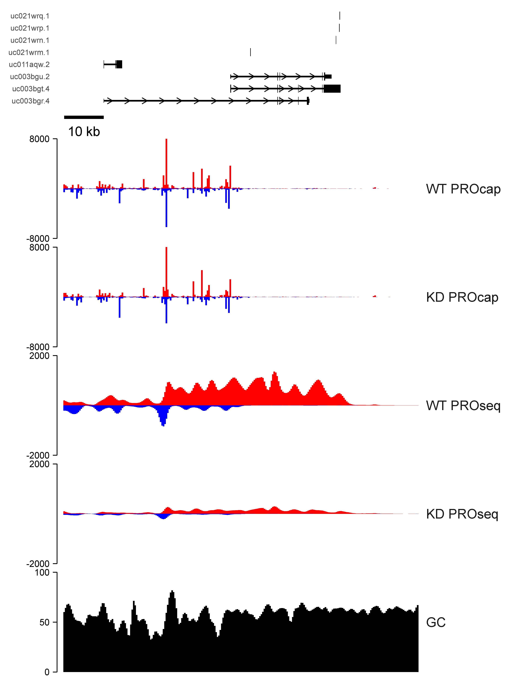
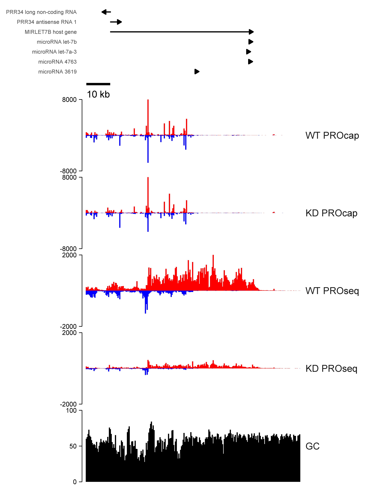
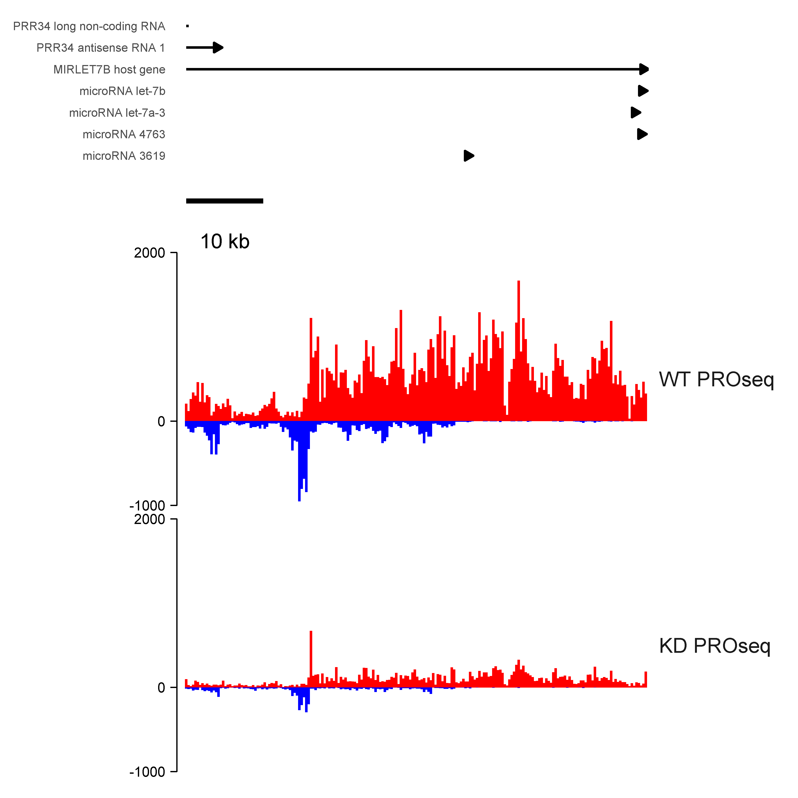

Assemble multiple tracks of publication-quality browser shots using BRGenomics
and ggplot2.

Browser tracks are created independently using identical coordinate systems on
the x-axis, and are aligned and assembled using the `patchwork` package. Any
number of tracks or track-groups can be created and combined piecemeal, as
demonstrated in the in the two example wrapper functions included.

## Smoothing

By default, plotting data is not smoothed, and you should check that the
binsizes used result in accurate representations of the data, as excessive bins
can cause overplotting.

If you want to go over to the dark side and use smoothing, there is an argument
to apply spline smoothing. If you want some other kind of smoothing, it's
straightforward to modify the smooth function.

## Requirements

* [BRGenomics](https://github.com/mdeber/BRGenomics)
* [patchwork](https://github.com/thomasp85/patchwork)
* dplyr
* ggplot2

## User Guide

### Importing Data

`rtracklayer` and/or `BRGenomics` can be used to import `bigWig`, `bedGraphs`,
or `bam` files as `GRanges` objects for plotting.

The main plotting function can take any number of `GRanges` objects, lists of
`GRanges` objects, or `GRangesList` objects as arguments. The only important
distinction is that data within the same list will share the same y-axis
scaling.

``` r
ps_ctrl_granges <- import_bigWig("~/path/to/plus.bw",
                                 "~/path/to/minus.bw",
                                 genome = "hg19")
# etc
```

And we'll group data sharing y-axis scaling into the same list. The names given
to these list elements will be used for plotting.

``` r
PROseq <- list("WT PROseq" = ps_ctrl_granges,
               "KD PROseq" = ps_kd_granges)
PROcap <- list("WT PROcap" = pc_ctrl_granges,
               "KD PROcap" = pc_ctrl_granges)
```

_[*] Lists can also be imported simultaneously with `import_bigWig()` For more,
see the BRGenomics guide for [Importing & Processing Data](
https://mdeber.github.io/articles/ImportingProcessingData.html)._

Plot regions are given by a `GRanges` object containing a single range. We'll
get one from a `TxDb` object, which will also allow us to plot full gene models.

``` r
library("TxDb.Hsapiens.UCSC.hg19.knownGene")
txdb <- TxDb.Hsapiens.UCSC.hg19.knownGene
txs <- transcripts(txdb) # GRanges object of full transcripts
my_region <- sample(subset(txs, width > 3e4), 1) # choose at random
```

I'll also load a track with genome-wide GC content. Because this track contains
continuous, dense data spanning the entire genome, I'll use
`rtracklayer::import.bw()` with the `which` argument, to only import data for
the region of interest:

``` r
GC_Content <- import.bw("~/path/to/hg19.gc5Base.bw", which = my_region)
```

### The Main Plotting Function

I recommend using the included wrapper function, `plot_shot()`, which provides
a great deal of convenience.

``` r
plot_shot(..., region, binsize = NULL, nbins = 250L,
          ylim = NULL, expand_ranges = TRUE, bin_FUN = sum,
          annotations = NULL, pad_left = 0, pad_right = 0,
          model_height = 1, gene_names = NULL, smooth = FALSE,
          ncores = getOption("mc.cores", 2L))
```
* `...`: One or more GRanges objects or _named_ lists of GRanges objects.
* `region`: A GRanges object with length = 1
* `binsize`, `nbins`, `bin_FUN`: When binning is used (either by supplying
`binsize` or `nbins`), `bin_FUN` will determine how data within each bin is
aggregated. `annotations` can either be
* `expand_ranges`: If all ranges have a width of 1, setting to `FALSE` improves
performance
* If `annotations` is a GRanges object (e.g. of genes/transcripts), simple gene
arrows are plotted, which are labeled by `gene_names`. If a `TxDb` object is
given, full gene models are plotted, and `gene_names` is ignored.
* `pad_left` and `pad_right`: positive numbers that expand `region` on either
side
* `model_height`: the relative height of the gene model/gene arrow plot vs.
the data plots
* `smooth`: If you're vain and shallow, setting this to `TRUE` will smooth the
plot data with cubic splines

See the examples for how to apply different arguments to the various datasets.

Phew!

## Plotting Examples

``` r
plot_shot(PROcap, PROseq, GC = GC_Content,
          region = region, pad_left = 1e4, pad_right = 2e4,
          expand_ranges = list(FALSE, FALSE, TRUE),
          bin_FUN = list(GC = mean),
          ylim = list(GC = c(0, 100)),
          annotations = txdb)
```


Take note of a few things above:

* `PROcap` and `PROseq` are both lists, but `GC_Content` is a simple `GRanges`
object. Everyone is welcome in the dots.
* I declared `GC = GC_Content` in order to set the plot label on the fly. That
will work as long as you don't try to set a label to "pad_left" or "bin_FUN"
or something.
* I gave a list of arguments to `expand_ranges`, one for each dataset group. You
can give unnamed list so long as its length matches the number of dataset
groups.
* For `bin_FUN` and `ylim`, I gave a named list indicating which plots to
modify. Everything else is set to the default.
* The `ylim`s are the same for both `PROcap` datasets and the `PROseq` datasets.
The default is to add up data within 250 bins across the plotting region, but
you should check to make sure the binning is appropriate to avoid overplotting.

Smoothing is graciously disabled by default, but you can activate it if you like
to do sad science. I'll add a silver lining by tweaking the axes a bit.

``` r
plot_shot(PROcap, PROseq, GC = GC_Content,
          region = my_region, pad_left = 1e4, pad_right = 2e4,
          expand_ranges = list(FALSE, FALSE, TRUE),
          bin_FUN = list(GC = mean),
          ylim = list(PROcap = c(-8000, 8000),
                      PROseq = c(-2000, 2000),
                      GC = c(0, 50, 100)),
          smooth = list(GC = TRUE),
          annotations = txdb)
```


Wow, look at the dishonesty. This might as well be IGV! I just didn't have the
heart to smooth the sequencing data.

Let's do one more, this time without supplying a `TxDb` object. Instead, we'll
give it our genelist.

``` r
plot_shot(PROcap, PROseq, GC = GC_Content,
          region = my_region, pad_left = 1e4, pad_right = 2e4,
          expand_ranges = list(FALSE, FALSE, TRUE),
          bin_FUN = list(GC = mean),
          ylim = list(PROcap = c(-8000, 8000),
                      PROseq = c(-2000, 2000),
                      GC = c(0, 50, 100)),
          smooth = FALSE, # peace for our time
          annotations = txsr, gene_names = names(txsr))
```


I'll be nice and show you how I got the gene names, but _only_ because you know
the profound consequences of plot smoothing on representing high-resolution,
high-dynamic-range genomics data.

``` r
library(org.Hs.eg.db)
txs$symbol <- select(org.Hs.eg.db, keys = txs$gene_id,
                     columns = "GENENAME",
                     keytype = "ENTREZID")[[2]]
txsr <- reduceByGene(txs, gene_names = txs$symbol)
# could also do genes(txdb), and the same select() call above
```

### The Individual Plotting Functions

You can also make the plots individually and assemble them yourself. The
underlying plot functions are:

* `shot_unstranded()` for unstranded datasets, or lists thereof
* `shot_stranded()` same for stranded data
* `shot_genemodel()` for generating full gene models from `TxDb` objects
* `shot_genearrow()` for plotting a genelist with simple lines with arrows
* `shot_scalebar()` for adding an automatically-sized and labeled scalebar

The above functions will all produce data on identical x-axes, and the
`patchwork` packaing will align them for us:

``` r
shot_genearrow(region, my_genelist, gene_names = my_genelist$symbol) +
    shot_scalebar(region = my_region) +
    shot_stranded(PROseq, my_region, binsize = 350) +
    plot_layout(heights = c(0.3, 0.1, 1), ncol = 1)
```


## Limitations

* Log-scaling will not plot correctly as negative signal values in stranded data
cannot be handled correctly.
* Currently a bug in `patchwork` that alters label justification only when a
there's only a single facet level present (which is how I structured
`plot_shot()`) ([Github issue 163](
https://github.com/thomasp85/patchwork/issues/163))
